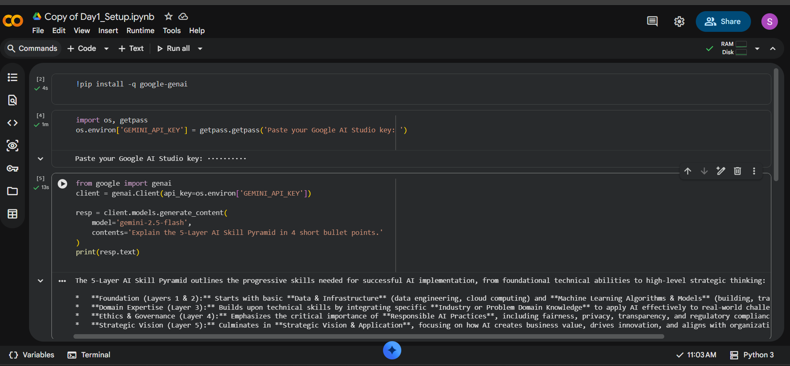

# ai-student-portfolio

```markdown
# AI Mentor Bootcamp — Surekha Reddy Gudimetla

Public portfolio of 12-day AI Trainer Workshop. By Day 12: 6 daily notebooks + capstone Streamlit URL.
```
```markdown
## Day 1 — Setup complete

- ✅ Google AI Studio API key provisioned
- ✅ Groq API key provisioned
- ✅ Hello-Gemini call working — see [Day1_Setup.ipynb](Day1_Setup.ipynb)
- 4-tool comparison matrix from Lab 1A: see screenshot below


```
(Upload the PNG via GitHub web UI: Add file → Upload files.)


